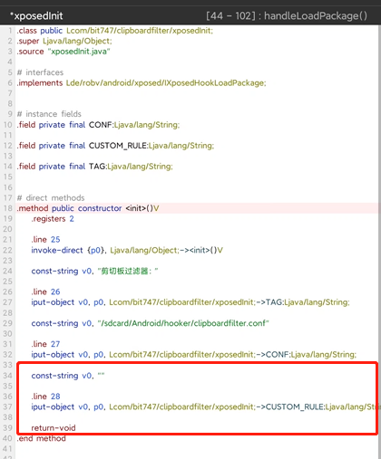

# ClipboardFilter
剪贴板写入过滤的xposed插件，基于正则表达式过滤剪贴板写入内容。默认hook所有app，lsposed可以选择作用域来限制。

部分源码来源于 https://github.com/congshengwu/Xposed_Clipboard 
 
## 用法：
### 1，被hook有存储权限
直接修改`/sdcard/Android/hooker/clipboardfilter.conf`，一行一条规则   
使用`Pattern.matches(pattern, content);`循环判断文件中的规则。  
保存规则前可以使用app自带的测试工具来测试规则是否生效。  
**使用存储重定向的用户需要特别注意，被重定向的app可能读取不倒配置文件！**  

### 2，没存储权限
#### 2.1 改源码
修改`com.bit747.clipboardfilter.xposedInit`，规则写到CUSTOM_RULE里，然后重新编译，多条规则需要用`\n`隔开  
#### 2.2 反编译
跟上面差不多，反编译找到`com.bit747.clipboardfilter.xposedInit`，找到CUSTOM_RULE上面的`""`，规则写里头，多条规则需要用`\n`隔开，然后重新编译，不同版本位置可能不同  

